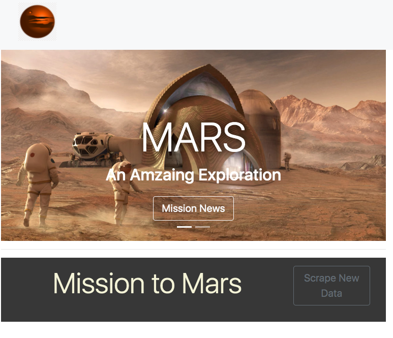
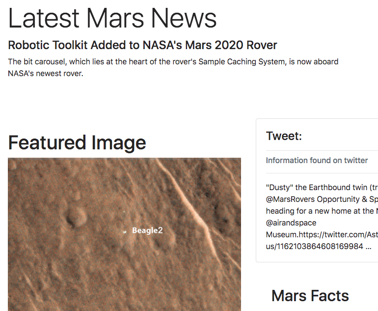
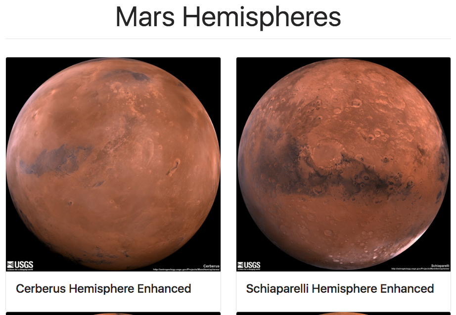
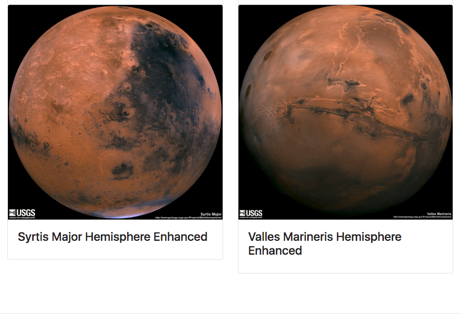

# Mission to Mars

In this assignment, I built a web application that scrapes various websites for data related to the Mission to Mars and displays the information in a single HTML page. 

# Step 1 - Scraping
- Completed the initial scraping using Jupyter Notebook, BeautifulSoup, Pandas, and Requests/Splinter.

- Created a Jupyter Notebook file called mission_to_mars.ipynb and use this to complete all of your scraping and analysis tasks. 

### NASA Mars News

- Scraped the NASA Mars News Site and collect the latest News Title and Paragraph Text. 
- Assigned the text to variables that I referenced later.

- JPL Mars Space Images - Featured Image

- Visited the url for JPL Featured Space Image.

### Mars Weather

- Visited the Mars Weather twitter account here and scrape the latest Mars weather tweet from the page. 
- Saved the tweet text for the weather report as a variable called mars_weather.

### Mars Facts

- Visited the Mars Facts webpage here and used Pandas to scrape the table containing facts about the planet including Diameter, Mass, etc.

- Used Pandas to convert the data to a HTML table string.

### Mars Hemispheres

- Visited the USGS Astrogeology site here to obtain high resolution images for each of Mar's hemispheres.

 

### Step 2 - MongoDB and Flask Application
- Used MongoDB with Flask templating to create a new HTML page that displays all of the information that was scraped from the URLs above.
